

  Frontend engineer by day. These are some of the things I've built that weren't my job. 
  <a href="https://benadams.dev"><b>benadams.dev</b></a>

<table>
  <tr>
    <th align="left"><h3><a href="https://benadams.dev/river">Middle Fork Rafting Simulator</a></h3>Multiplayer whitewater in Godot. Proceduraly generated river. Every seed is different so as they say </ br>"No man ever steps in the same river twice..."</th>
  </tr>
  <tr>
    <td><a href="https://benadams.dev/river">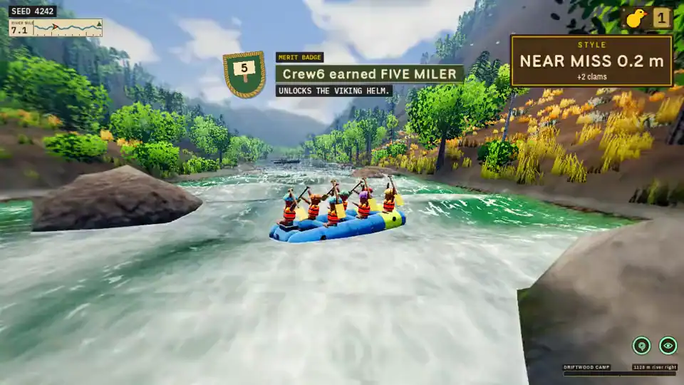</a></td>
  </tr>
</table>

<table>
  <tr>
    <th align="left" colspan="2"><h3>Prognosticator</h3>DJ software that runs the lights on the beat, in a real room or one that does not exist.</th>
  </tr>
  <tr>
    <td width="50%">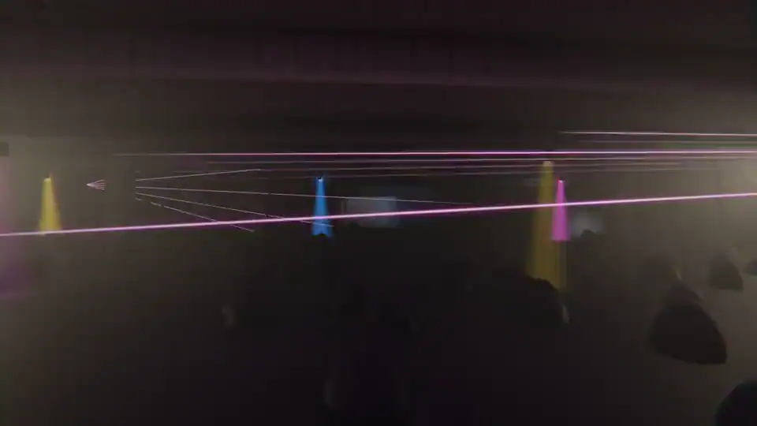</td>
    <td width="50%">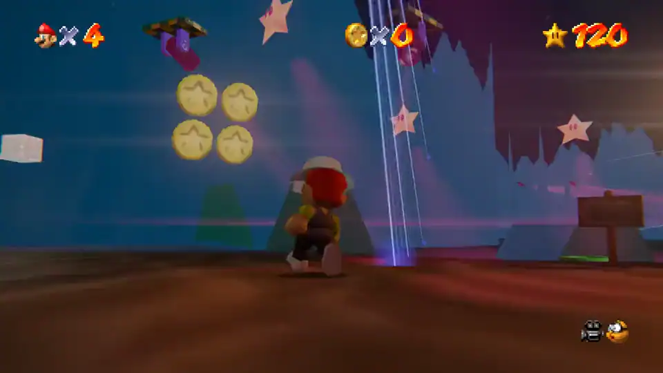</td>
  </tr>
  <tr>
    <td></td>
    <td></td>
  </tr>
</table>

<table>
  <tr>
    <th align="left" colspan="2"><h3><a href="https://benadams.dev/scrandle/play">Scrandle</a></h3>A daily game built from my friends' dinner photos.</th>
  </tr>
  <tr>
    <td width="50%"><a href="https://benadams.dev/scrandle/play">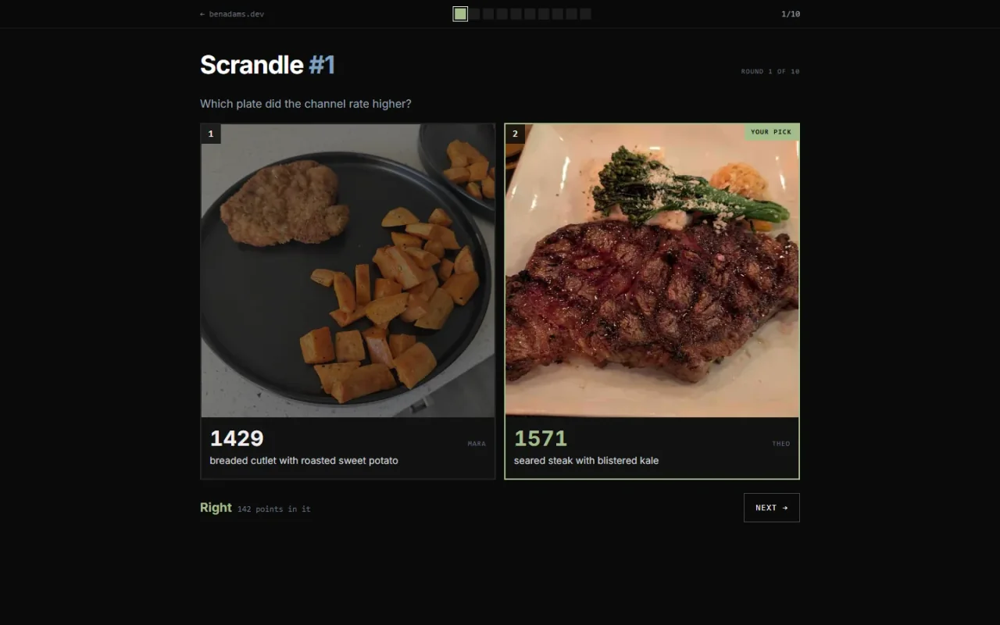</a></td>
    <td width="50%"></td>
  </tr>
</table>

<table>
  <tr>
    <th align="left" colspan="2"><h3><a href="https://benadams.dev/yut-hut">Yut Hut</a></h3>A Discord bot that turns workouts into Old School RuneScape levels.</th>
  </tr>
  <tr>
    <td width="42%"><a href="https://benadams.dev/yut-hut">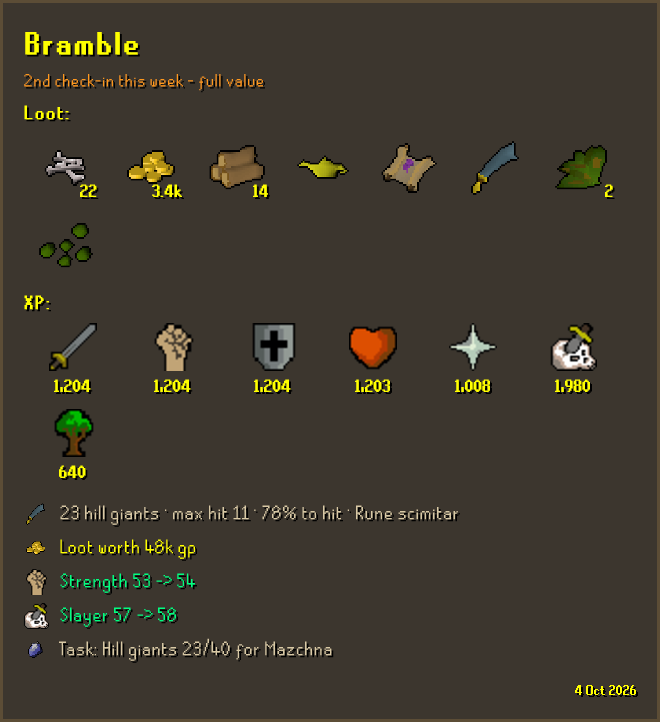</a></td>
    <td width="58%">
      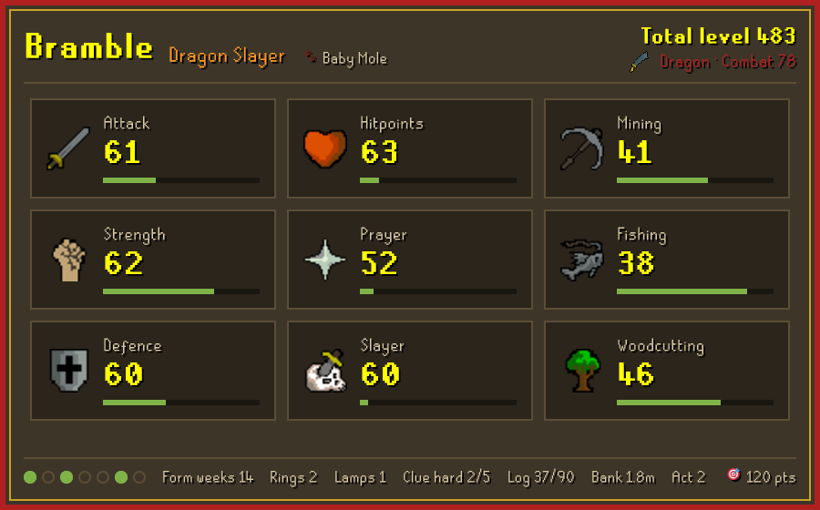
      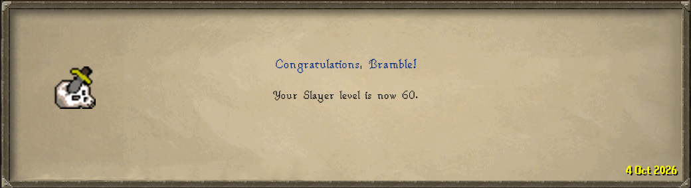
    </td>
  </tr>
</table>

<table>
  <tr>
    <th align="left" colspan="3"><h3>Tools I use every week</h3><a href="https://benadams.dev/commander">Commander</a>, <a href="https://benadams.dev/tutor-helper">tutors</a> and <a href="https://benadams.dev/token-helper">tokens</a> for Magic, <a href="https://benadams.dev/floatwise">float trips</a>, and <a href="https://benadams.dev/dota-randomizer">Dota</a>.</th>
  </tr>
  <tr>
    <td width="33%"></td>
    <td width="33%"><a href="https://benadams.dev/tutor-helper">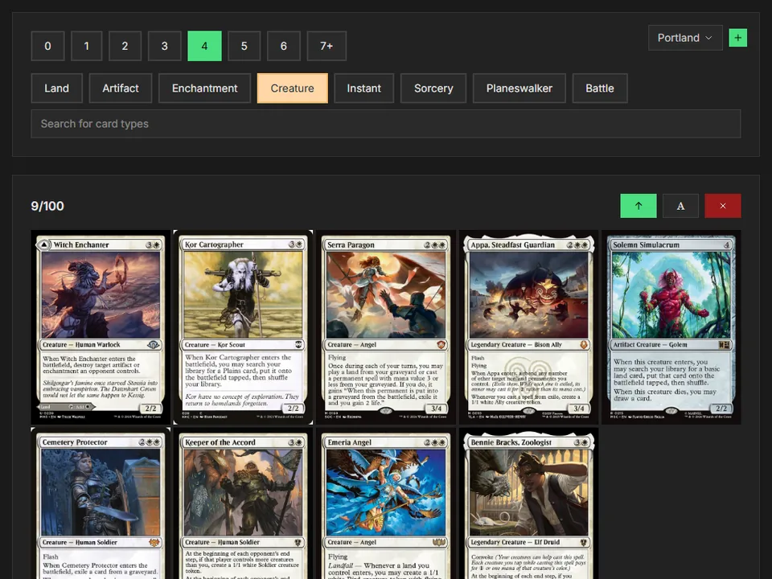</a></td>
    <td width="33%"><a href="https://benadams.dev/token-helper">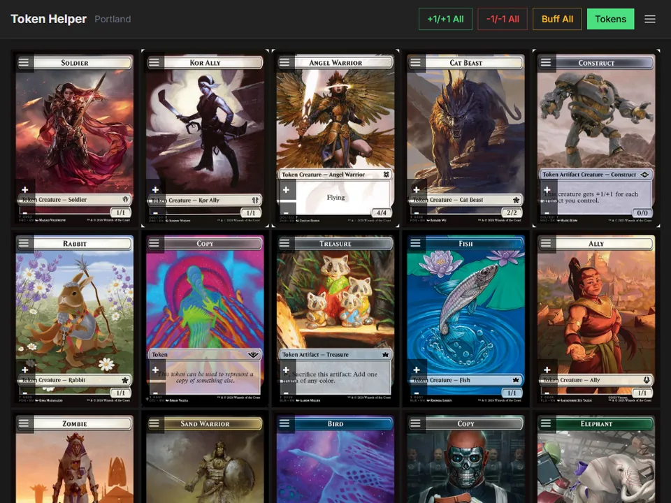</a></td>
  </tr>
  <tr>
    <td colspan="3">
      <a href="https://benadams.dev/floatwise">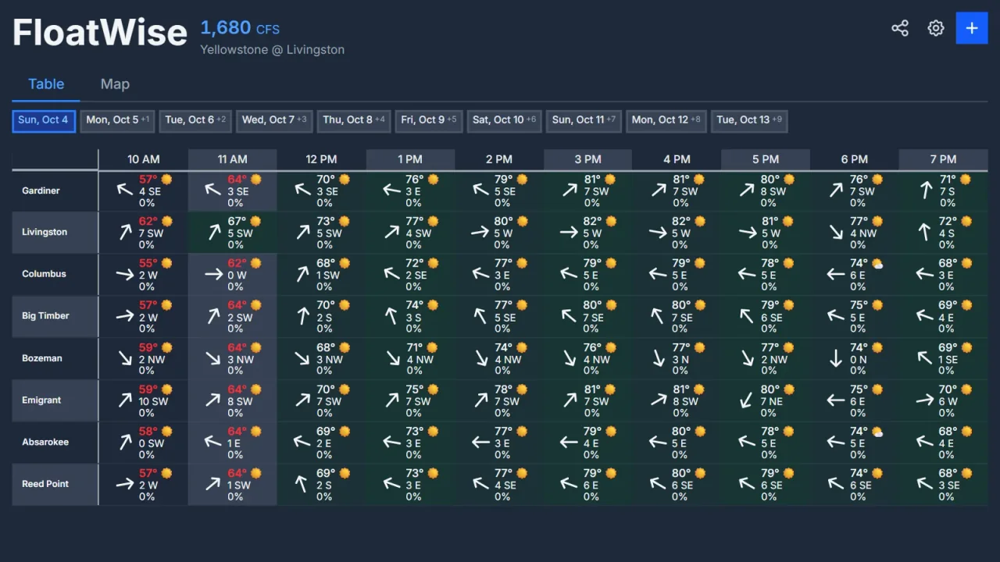</a>
      <a href="https://benadams.dev/dota-randomizer">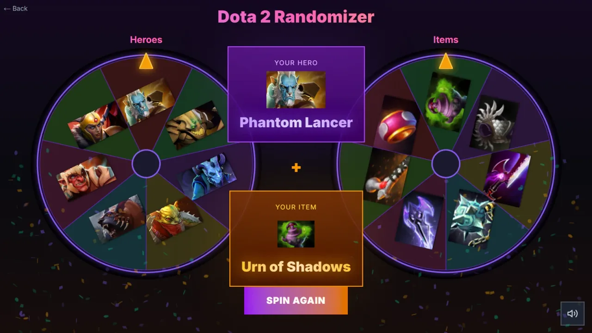</a>
    </td>
  </tr>
</table>

<table>
  <tr>
    <th align="left"><h3>hobbit.house</h3>A phone remote for the living room PC, lights and music.</th>
  </tr>
  <tr>
    <td align="center">
      
      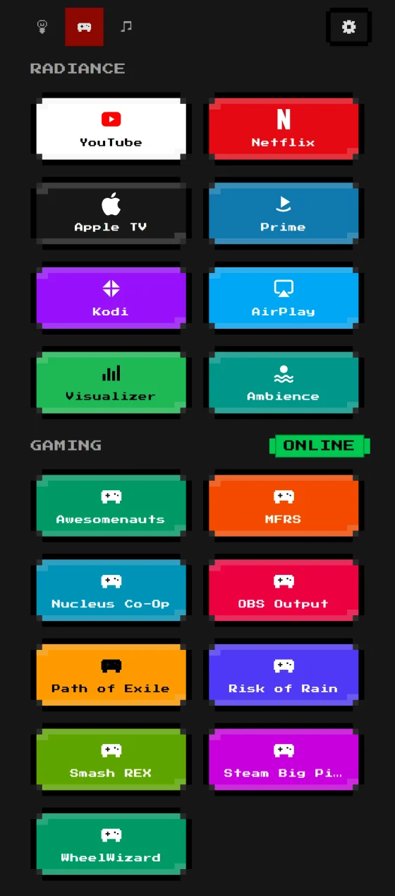
      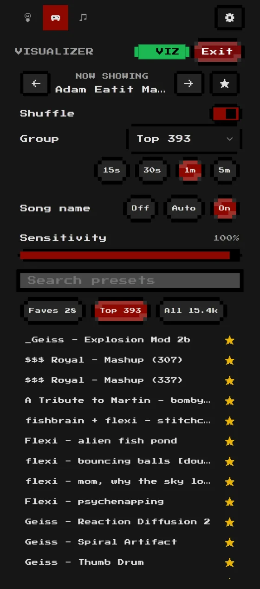
      
    </td>
  </tr>
</table>
